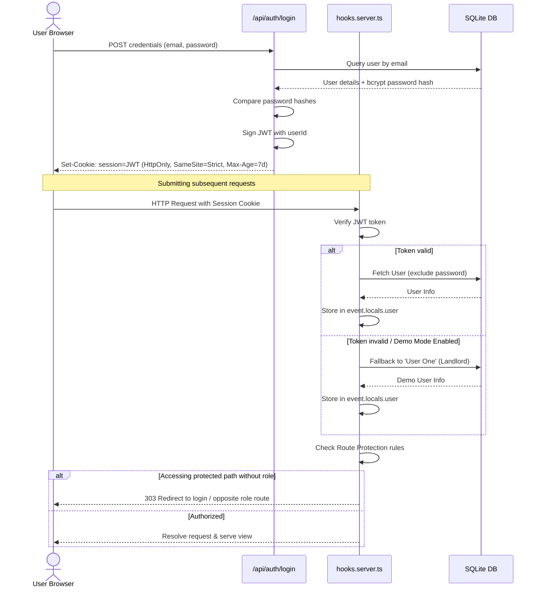
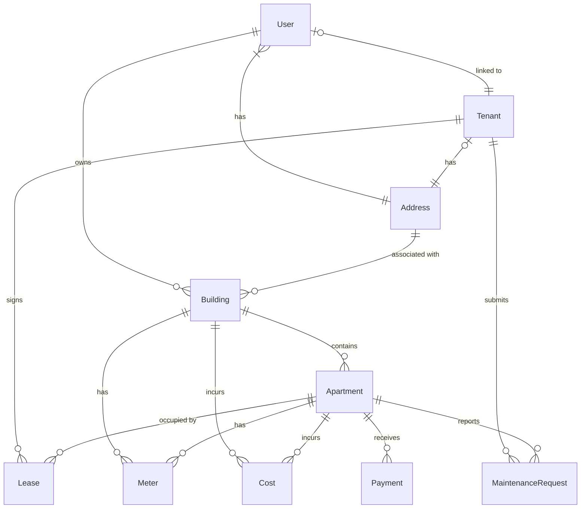

# LeaseWorks Premium Rewrite & Engineering Handoff (Lease Works)

This document provides a comprehensive overview of the tech stack, codebase architecture, user flows, database schema, design specifications, and implementation guidelines for the property management application.

---

## Technology Stack

1. **Framework**: **SvelteKit** (using Svelte 5 and Vite)
2. **Styling**: **Tailwind CSS v4** (packaged natively inside the Vite compilation pipeline)
3. **Database & ORM**: **Prisma** with a local **SQLite** database (`prisma/dev.db`)
4. **Authentication**: Cookie-based sessions validated using **JSON Web Tokens (JWT)** and passwords encrypted with **bcrypt**.
5. **Iconography**: **Google Material Symbols Outlined** (loaded dynamically)

---

## Repository Structure

```
├── prisma/
│   ├── dev.db             # SQLite local database
│   ├── schema.prisma      # Prisma schema definition
│   └── seed.ts            # Database seeding script for mock landlord/tenant data
├── src/
│   ├── app.css            # Base Tailwind imports & CSS entries
│   ├── app.d.ts           # Global TypeScript types (SvelteKit locals structure)
│   ├── app.html           # Root HTML layout template
│   ├── hooks.server.ts    # Server hooks (Auth middleware, protected routes, logging)
│   ├── components/        # Reusable Svelte UI components
│   │   ├── EntityForm.svelte      # Dynamic metadata-driven form builder
│   │   ├── EntityList.svelte      # Searchable, filterable CRUD grid container
│   │   ├── EntityDetail.svelte    # Shell for individual resource detail pages
│   │   └── ...                    # Buttons, footers, visual cards
│   ├── lib/
│   │   ├── entities.ts            # Type definitions, enums, FormFieldSchemas
│   │   ├── houseGraphic.ts        # SVG rendering logic for property outlines
│   │   ├── numericHelper.ts       # Utility currency & size formatters
│   │   ├── server/
│   │   │   └── prisma.ts          # Singleton Prisma Client exporter
│   │   └── styles/                # Double-Ledger CSS system (tokens, components, utilities)
│   └── routes/            # SvelteKit route hierarchy
│       ├── +layout.svelte         # Primary shell toggling Landlord Sidebar vs Tenant Top-Nav
│       ├── api/                   # REST backend controllers (Auth, CRUD, dashboard aggregates)
│       └── ...                    # Page layouts, styles, and route directories
```

---

## Authentication & Session Lifecycle

The application enforces a cookie-based session pattern secured by token verification.



### 1. Login Flow (`/api/auth/login`)
- Authenticates credentials against the SQLite database using `bcrypt.compare`.
- Generates a JSON Web Token (JWT) signed with the user's ID using `jsonwebtoken`.
- Attaches the JWT to the response headers as an `HttpOnly`, `SameSite=Strict` cookie named `session` with a 7-day expiration.

### 2. Session Hook (`src/hooks.server.ts`)
- Parses request headers to extract the `session` cookie.
- If verified, retrieves the User record (excluding password) using the `prisma` client, populating `event.locals.user`.
- **Demo Fallback**: In local development, `DEMO_MODE` defaults to `true`. If no token exists, it automatically queries the DB for `User One` (Landlord role) and registers it to `event.locals.user` to simplify test flows.

### 3. Route Protection (`src/hooks.server.ts`)
- **Landlord Protection**: Routes matching `/landlord*` require `locals.user.role === 'LANDLORD'`. Violation redirects the request to `/tenant` or `/login`.
- **Tenant Protection**: Routes matching `/tenant*` require `locals.user.role === 'TENANT'`. Violation redirects the request to `/landlord` or `/login`.

### 4. Layout Propagation (`src/routes/+layout.server.ts`)
- Exposes `event.locals.user` to the client as SvelteKit page data (`data.user`), allowing navigation menus in `+layout.svelte` to toggle views dynamically.

---

## Database Schema Overview (SQLite / Prisma)

The database schema manages relationship models for property administration.



### Primary Database Models (`prisma/schema.prisma`):
- **User**: Authentication accounts (Landlord / Tenant roles). Holds security flags.
- **Address**: Shared repository of addresses linked to Users, Tenants, and Buildings.
- **Building**: Physical properties owned by landlords. Tracks address and total floors.
- **Apartment**: Sub-units containing size specifications, apartment type descriptors, and floor locations.
- **Tenant**: Profile of tenant individuals.
- **Lease**: Contract mapping a `Tenant` to an `Apartment` with a rent amount and active dates.
- **Payment**: Billing records mapping rent schedules. Statuses: `paid`, `pending`, `overdue`.
- **Meter**: Utility trackers for gas, water, or electric usage, holding cost-per-unit metrics. Can be bound to a Building or an Apartment (mutually exclusive).
- **Cost**: Financial outlays (e.g., maintenance bills, service charges). Can be bound to a Building or an Apartment (mutually exclusive).
- **MaintenanceRequest**: Tenant-submitted trouble tickets. urgencies: `LOW`, `MEDIUM`, `HIGH`, `EMERGENCY`. Statuses: `PENDING`, `IN_PROGRESS`, `RESOLVED`.

---

## Route Hierarchy

SvelteKit's file-based router manages pages and API boundaries:

### User-Facing Pages
- `/` - Public overview page detailing marketing, value columns, and actions.
- `/login` - Portal entrance enabling credential verification and role swaps.
- `/landlord` - Dashboard for landlords showing priority alerts, financial aggregates, and property tables.
- `/tenant` - Living portal for tenants showing rent indicators, lease terms, and issue reports.
- `/tenant/maintenance/new` - Issue report form with simulated attachments.
- `/addresses`, `/apartments`, `/buildings`, `/costs`, `/leases`, `/meters`, `/tenants` - Administrative CRUD grids.

### API Endpoints (`/src/routes/api/...`)
- `/auth/login` & `/auth/logout` - Session lifecycle controllers.
- `/finances` - Landlord incoming vs. outgoing cost and rent trackers.
- `/maintenance` - Ticket submission and status resolver endpoint.
- `<entity>` & `<entity>/[id]` - Universal REST API endpoints for schema-conforming items.

---

## Component Architecture

The codebase utilizes a metadata-driven architecture to keep files clean and DRY:

```
                  ┌──────────────────────┐
                  │   src/lib/entities   │
                  │  (FormFieldSchemas)  │
                  └──────────┬───────────┘
                             │
                             ▼
 ┌─────────────────────────────────────────────────────────┐
 │                 EntityList.svelte                       │
 │  (Renders Table, Handles Search, Loads Collection Feed) │
 └────────────────────────────┬────────────────────────────┘
                              │
                              ▼
 ┌─────────────────────────────────────────────────────────┐
 │                 EntityForm.svelte                       │
 │  (Compiles Inputs, Validates Fields, Resolves FK Refs)  │
 └────────────────────────────┬────────────────────────────┘
                              │
                              ▼
 ┌─────────────────────────────────────────────────────────┐
 │                 REST Controller Endpoint                │
 │  (Performs DB mutations via Prisma & SQL Client)        │
 └─────────────────────────────────────────────────────────┘
```

1. **FormFieldSchema (`src/lib/entities.ts`)**:
   Schemas specify validation metadata (type, labels, required flags, option arrays, relationship types, mutual exclusions) for each database table.
2. **EntityList.svelte**:
   Generic list viewer that manages pagination status, keyword filtering, base path navigations, and embeds the create/edit modal.
3. **EntityForm.svelte**:
   Dynamically generates forms based on the `FormFieldSchema[]`. It resolves relationships by fetching appropriate options (e.g., Address streets or Buildings) and performs input verification client-side before POSTing to the database endpoints.
4. **Layout Navigation Shell (`+layout.svelte`)**:
   Reads the active route namespace and swaps between:
   - **Tenant View**: Top navbar layout using emerald headers, tactile navigation options, and center-aligned contents.
   - **Landlord View**: Full-height sidebar using a double-border grid layout and slate-brown interactive options.

---

## State Management Philosophy

- **Server-Side Page Loaders**: Critical dashboards fetch data using `+page.server.ts` scripts directly through Prisma on the server side for immediate loading and SSR benefits.
- **Client-Side CRUD Fetching**: Administrative entity lists load collections asynchronously inside Svelte's `onMount` lifecycle method via `/api/<entity>` endpoints.
- **Action Invalidation**: After performing a database modification (e.g., resolving a maintenance request or submitting a payment), client-side code executes `invalidateAll()` to trigger reload cycles in active page servers.
- **No Heavy Client Stores**: Session variables pass down through SvelteKit page data (`$page.data.user`), eliminating local storage trackers or complex store frameworks.

---

## Design Rules (Lease Works)

Any changes to the UI must adhere strictly to the editorial "Lease Works" aesthetic:

*   **Grid Dividers**: Layout borders must utilize Svelte double lines (`border-double`) resembling vintage paper ledgers.
*   **Typography Hierarchy**: Headers must use Serif fonts (`Lora` / `Domine`). Lists, records, input placeholders, and badge text must use Sans-serif (`Libre Franklin` / `Work Sans`).
*   **Colors**:
    - *Success/Landlord action*: Primary Emerald Green (`#006a40`/`#12a165`).
    - *Error/Overdue*: Ledger Red (`#D95D52`/`#ba1a1a`).
    - *Base Backgrounds*: Warm Parchment (`#FAF9F6`) on Tenant pages, white and parchment panels on Landlord pages. Avoid pure grays or deep black screens.
*   **Corners & Outlines**: Match physical folders using sharp or minimally rounded edges (`rounded-sm` / 2px or 4px) and subtle tan border grids (`border-[#D6D4CD]`).

---

## Known Technical Debt & Constraints

1. **Static Development Demo Flag**: The `hooks.server.ts` script contains a hardcoded `DEMO_MODE = true` fallback. This bypasses authentication verification and automatically logs in a landlord profile if cookies are absent. This must be disabled/removed for production environments.
2. **Client-Side Fetch Overhead**: Administrative tables load collections via Svelte `onMount` client-side API requests instead of using server load scripts, which causes minor layout shifts on page entry.
3. **Set-Cookie Header Construction**: Authentication controllers write explicit header configurations (`Set-Cookie`) instead of SvelteKit's standardized `cookies.set` abstraction.
4. **Duplicate Form Validation**: Input restrictions (such as integer constraints or required attributes) are evaluated in client-side schemas, with backend controllers relying on raw DB transaction try-catches rather than an intermediate validation validator (e.g., Zod).

---

## Next Implementation Priorities

1. **Tenant Utility Billing & Reporting**: Build interactive UI grids displaying past utility costs and water/electricity usage trackers using SVG/CSS chart structures.
2. **Dynamic Invoicing Generator**: Construct automated PDF invoice templates matching the double-ledger aesthetic for lease agreements and monthly payments.
3. **Form Actions Refactor**: Convert administrative CRUD paths from client-side `onMount` requests to server loaders and SvelteKit Form Actions to secure transaction layers.
4. **Prisma Schema Constraints**: Strengthen database validation constraints using intermediate filters or middleware layers before database insertion.

---

## Coding Conventions

- **Prisma Garbage Collection**: To prevent connection leak timeouts, every API controller querying the database must close database channels using a `finally` block:
  ```typescript
  try {
      // DB operations
  } catch (err) {
      // Error handling
  } finally {
      await prisma.$disconnect();
  }
  ```
- **Type Safety**: Avoid using `any` typings. Define detailed interfaces in `src/lib/entities.ts` for relationship schemas.
- **Schema Synchronization**: When altering fields in `schema.prisma`, update the corresponding `FormFieldSchema` array in `src/lib/entities.ts` to ensure form builders load correct input parameters.
